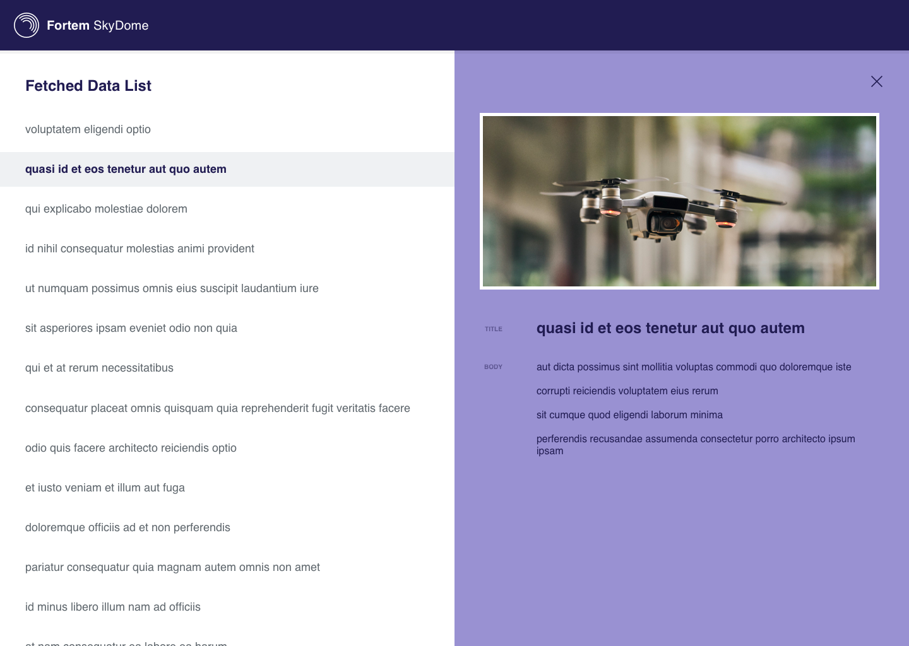

# Fortem Front End Exercise

We want to see some of your basic front end chops by doing some basic front end things.  It shouldn't be too difficult.  You'll be recreating the layout based on [assets/reference.svg](./assets/reference.svg).  Use [assets/reference-details.png](./assets/reference-details.png) for reference for CSS.  Feel free to open up the SVG file in Sketch or any other program to get dimensions, fonts, colors, or whatever you need that may not be covered on the details image.  

We're fans of components, so feel free to break things into individual components.

## Instructions

### 1. Fork this Repo on GitHub

Fork this repo on GitHub.

### 2. Use Front End Library/Framework  

Use any Front End library or framework.  We currently use Angular 7.

### 3. Create a Fixed Header

Make a fixed header that is always present at the top of the page.  Use the images mentioned above for reference.  
	
### 4. Scrollable Data List

Fetch a list of data from [https://jsonplaceholder.typicode.com/posts](https://jsonplaceholder.typicode.com/posts) and load it on the page using the `title` as a clickable target to trigger the details display.
	
### 5. Data Details Slide Out

Create an animated slide out panel on the right side that overlays the main content when a `title` from the list is clicked.  Use the data associated with the `title` that was clicked on.  The slide out should be able to be closed by clicking on an `x` or close icon in the upper right.

### 6. Random Details Image

Insert a random image at the top of the data details using a consistent dimension between posts and keeping the image unskewed.  The dimensions do not have to be the exact dimensions from the SVG listed above.

### 7. Email Repo Link

Once you feel it's ready, shoot an email to brandon.buttars@fortemtech.com with a link to the repo.  Make sure it's public so we can access it or if you need to keep it private make sure user `brandonbuttars` can access it.